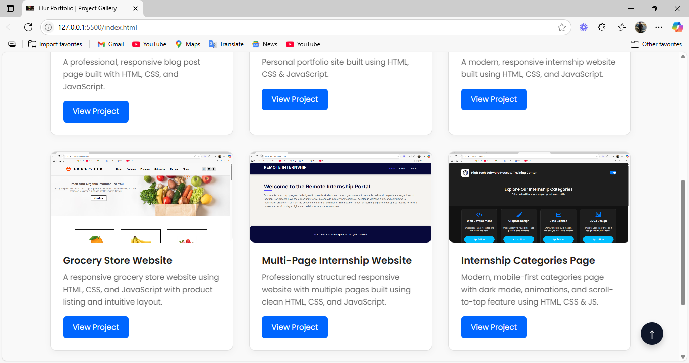

# 🎨 Internship Project Gallery

A clean, responsive, and interactive **project showcase gallery** built using HTML, CSS, and vanilla JavaScript — designed for internship task submissions and project portfolios.

## 🚀 Features

- 🌐 Responsive layout (mobile-first design)
- 🔍 Lightbox image preview on click
- 🌀 Scroll reveal animations
- ⬆️ Scroll-to-top button
- 🌑 Dark-themed modern UI
- 💡 Clean code with comments and readable class names

## 📸 Gallery Preview

Sample images used in this project:

| Image 1 | Image 2 |
|--------|---------|
|  |  |

| Image 3 | Image 4 |
|--------|---------|
|  |  |

**Bilal Zafar**  
💻 Web Developer Intern  
📧 bilalzafar7350@gmail.com  
🌐 [LinkedIn](https://www.linkedin.com/in/bilal-zafar-bb2a07276/)
